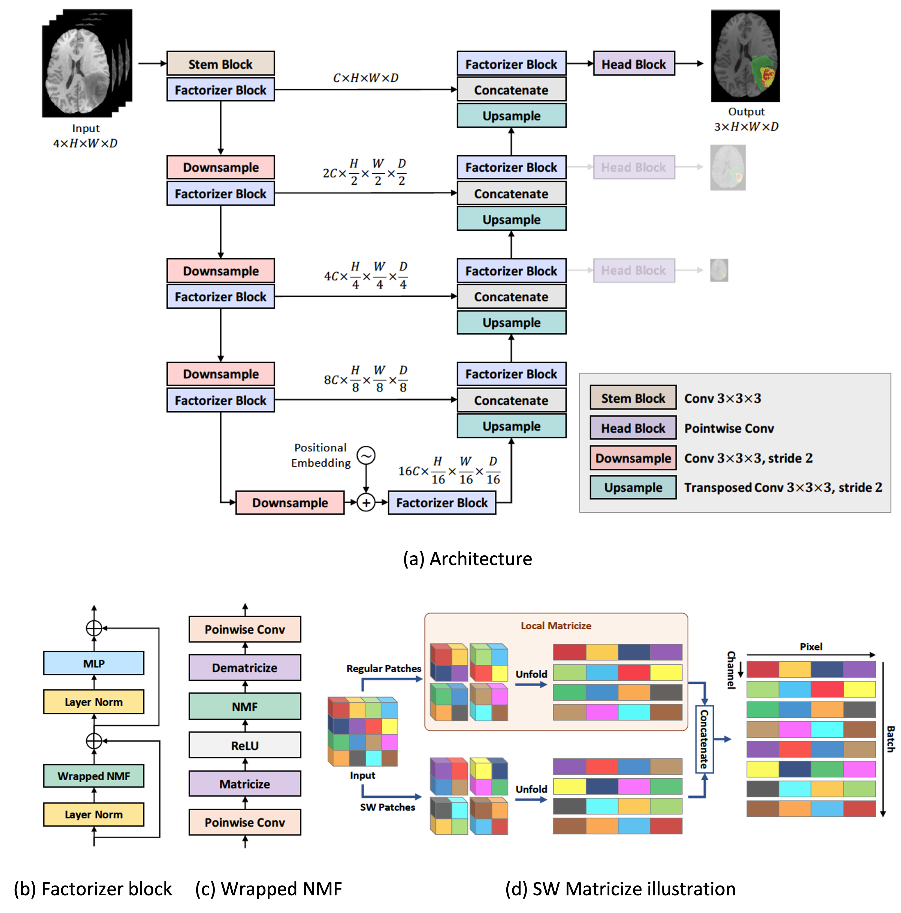

This repo is the official implementation of ["Factorizer: A Scalable Interpretable Approach to Context Modeling for Medical Image Segmentation"](https://arxiv.org/abs/2202.12295).


## Introduction

**Factorizer** leverages the power of low-rank matrix approximation to construct end-to-end deep models for medical image segmentation. Built upon differentiable matrix factorization layers and matricize operations, Factorizers with U-Shaped architectures can compete favorably with CNN and Transformer baselines in terms of accuracy, scalability, and interpretability. The methods and results for the task of brain tumor segmentation are presented in detail in the [paper](https://arxiv.org/abs/2202.12295).




## Installation
First make sure that you have already installed [PyTorch](https://pytorch.org/get-started/locally/) since the details on how to do this depend on whether you have a CPU, GPU, etc. Then, for installing the Factotizer package, do this:

```bash
$ pip install git+https://github.com/pashtari/factorizer.git
```


## Usage

**Nonnegative Matrix Factorization Layer**
```python
import torch
from torch import nn
import factorizer as ft

nmf = ft.NMF(size=(8, 512), rank=2, num_iters=5, init="uniform", solver="mu")

x = torch.rand((1, 8, 512), requires_grad=True)

y = nmf(x) # (1, 8, 512)

print(f"FLOPS = {nmf.flops}") # FLOPS per sample
```
    FLOPS = {'init': 0, 'decompose': 226240, 'reconstruct': 16384}

**Shifted Window Matricize**
```python
sw_matricize = ft.SWMatricize((32, 128, 128, 128), head_dim=8, patch_size=8)

x = torch.rand(32, 128, 128, 128)

y = sw_matricize(x)  # (262144, 8, 64)

z = sw_matricize.inverse_forward(y)

torch.equal(x, z) # True
```

**Swin Factorizer Subblock (Wrapped NMF)**
```python
swin_factorizer_subblock = ft.FactorizerSubblock(
    input_dim = 32,
    output_dim = 32,
    spatial_size = (128, 128, 128),
    tensorize=(ft.SWMatricize, {"head_dim": 8, "patch_size": 8}),
    act=nn.ReLU,
    factorize=(ft.NMF, {"rank": 1, "init": "uniform", "solver": "hals"}),
)

x = torch.rand(1, 32, 128, 128, 128)

y = swin_factorizer_subblock(x) # (1, 32, 128, 128, 128)
```

**Swin Factorizer**
```python
swin_factorizer = ft.SegmentationFactorizer(
    in_channels=4,
    out_channels=3,
    spatial_size=(128, 128, 128),
    encoder_depth=(1, 1, 1, 1, 1),
    encoder_width=(32, 64, 128, 256, 512),
    strides=(1, 2, 2, 2, 2),
    decoder_depth=(1, 1, 1, 1),
    stem=(nn.Conv3d, {"kernel_size": 3, "padding": 1, "bias": False},),
    downsample=(nn.Conv3d, {"kernel_size": 2, "bias": False}),
    upsample=(nn.ConvTranspose3d, {"kernel_size": 2}),
    head=(nn.Conv3d, {"kernel_size": 1}),
    num_deep_supr=3,
    dropout=0.1,
    nmf=(
        ft.FactorizerSubblock,
        {
            "tensorize": (ft.SWMatricize, {"head_dim": 8, "patch_size": 8}),
            "act": nn.ReLU,
            "factorize": ft.NMF,
            "rank": 1,
            "num_iters": 5,
            "num_grad_steps": None,
            "init": "uniform",
            "solver": "hals",
            "dropout": 0.1,
        },
    ),
    mlp=(ft.MLP, {"ratio": 2, "dropout": 0.1}),
)

x = torch.rand(1, 4, 128, 128, 128)

y = swin_factorizer(x) # len(y) = 3

y[0].shape, y[1].shape, y[2].shape
```

    (torch.Size([1, 3, 128, 128, 128]),
    torch.Size([1, 3, 64, 64, 64]),
    torch.Size([1, 3, 32, 32, 32]))


## Data Preparation

To reproduce the results of brain tumor segmentation presented in the [paper](https://arxiv.org/abs/2202.12295), please download [Task01_BrainTumour](https://drive.google.com/file/d/1A2IU8Sgea1h3fYLpYtFb2v7NYdMjvEhU/view) (BraTS) from the [Decathlon database](http://medicaldecathlon.com/). Our data module requires the path to a JSON file (or a Python dictionary) containing the data properties, including the locations of the training images, training labels, and test images (if they exist). It is recommended to place the JSON file in the data folder so that relative paths can be used for simplicity, as exemplified below for BraTS:

```bash

Task01_BrainTumour
├── dataset.json # data properties 
├── imagesTr
│   ├── BRATS_001.nii.gz
│   └── ...
├── labelsTr
│   ├── BRATS_001.nii.gz
│   └── ...
└── imagesTs
    ├── BRATS_485.nii.gz
    └── ...
```

## Training
To train a model from the terminal:

```bash
cd ./bin
python train.py --config config.yaml
```

where `config.yaml` is the config file. You can find the config files in [./bin/configs](./bin/configs), but before using them, change their values of `data_properties` to yours. For example, the first fold of a 5-fold cross-validation to train Swin Factorizer on the BraTS dataset using two GPUs is done by 

```bash
cd ./bin
python train.py --config configs/brats/config_brats_fold0_swin-factorizer.yaml
```
The model checkpoints will then be saved in `./bin/logs/brats/fold0/swin-factorizer/version_0/checkpoints`, which is specified in the config file.


## Validation

**Example.** The first fold of 5-fold cross-validation to validate Swin Factorizer on the BraTS dataset using two GPUs is done by

```bash
cd ./bin
python validate.py --config configs/brats/config_brats_fold0_swin-factorizer.yaml
```
The results will then be saved as `results.csv` in `./bin/logs/brats/fold0/swin-factorizer/version_0`. A valid checkpoint path is required to perform a validation loop. In this example, as specified in the config file, the path to the checkpoint is `logs/brats/fold0/swin-factorizer/version_0/checkpoints/epoch=515-step=99999.ckpt`.


## Models

All the trained models and results can be downloaded via the [OneDrive link](https://kuleuven-my.sharepoint.com/:f:/g/personal/pooya_ashtari_kuleuven_be/Ej0kOf9wSt1NueXP1_M0Nn0BawQ_gqhslJO2GD-rjZLC-w?e=KzRfae), as a folder named logs. Once you downloaded the logs folder, place it inside the folder [./bin](./bin).

```bash
bin
├── configs
│   └── brats
│       ├── config_brats_fold0_swin-factorizer.yaml
│       └── ...
├── logs
│   └── brats
│       ├── fold0
│       │   ├── swin-factorizer
│       │   │   └── version_0
│       │   │       ├── checkpoints
│       │   │       │   └── epoch=515-step=99999.ckpt
│       │   │       ├── results.csv
│       │   │       └── ...
│       │   └── ...
│       └── ...
├── registry.py
├── train.py
├── validate.py
└── ...
```


## License

This repository is released under the Apache 2.0 license as found in the [LICENSE](LICENSE) file.


## Citation

If you use this code for a paper, please cite:

```
@article{ashtari2022factorizer,
      title={Factorizer: A Scalable Interpretable Approach to Context Modeling for Medical Image Segmentation}, 
      author={Pooya Ashtari and Diana Sima and Lieven De Lathauwer and Dominique Sappey-Marinierd and Frederik Maes and Sabine Van Huffel},
      year={2022},
      eprint={2202.12295},
      archivePrefix={arXiv},
      primaryClass={eess.IV}
}
```


## Contact

This repo is currently maintained by Pooya Ashtari ([@pashtari](https://github.com/pashtari)).