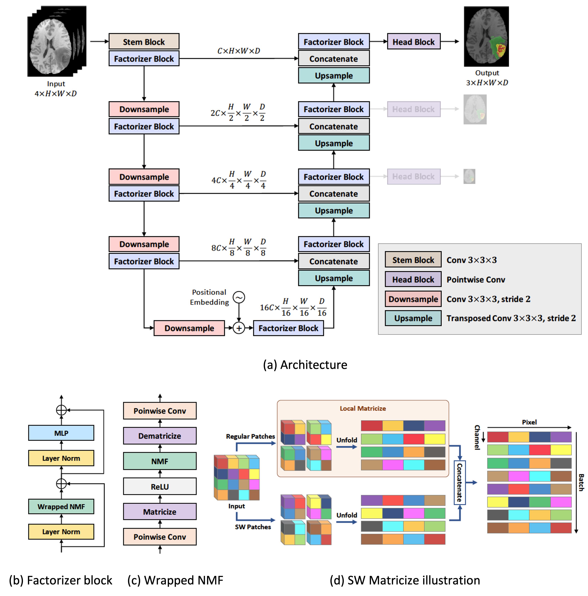

# Factorizer

This repo is the official implementation of ["Factorizer: A Scalable Interpretable Approach to Context Modeling for Medical Image Segmentation"](https://arxiv.org/abs/2202.12295) for medical image segmentation.

## Introduction

**Factorizer** leverages the power of low-rank matrix approximation to construct end-to-end deep models for medical image segmentation. Built upon nonnegative matrix factorization and shifted window idea, Swin Factorizer competes favorably with CNN and Transformer baselines in terms of accuracy, scalability, and interpretability, achieving state-of-the-art results on the task of brain tumor segmentation. The method is described in detail in the [paper](https://arxiv.org/abs/2202.12295).




## Install
$ pip install -e factorizer


## License
This repository is released under the Apache 2.0 license as found in the [LICENSE](LICENSE) file.


## Citation
If you use this code for a paper, please cite:

```
@article{ashtari2022factorizer,
      title={Factorizer: A Scalable Interpretable Approach to Context Modeling for Medical Image Segmentation}, 
      author={Pooya Ashtari and Diana Sima and Lieven De Lathauwer and Dominique Sappey-Marinierd and Frederik Maes and Sabine Van Huffel},
      year={2022},
      eprint={2202.12295},
      archivePrefix={arXiv},
      primaryClass={eess.IV}
}
```


## Contact

This repo is currently maintained by Pooya Ashtari ([@pashtari](https://github.com/pashtari))