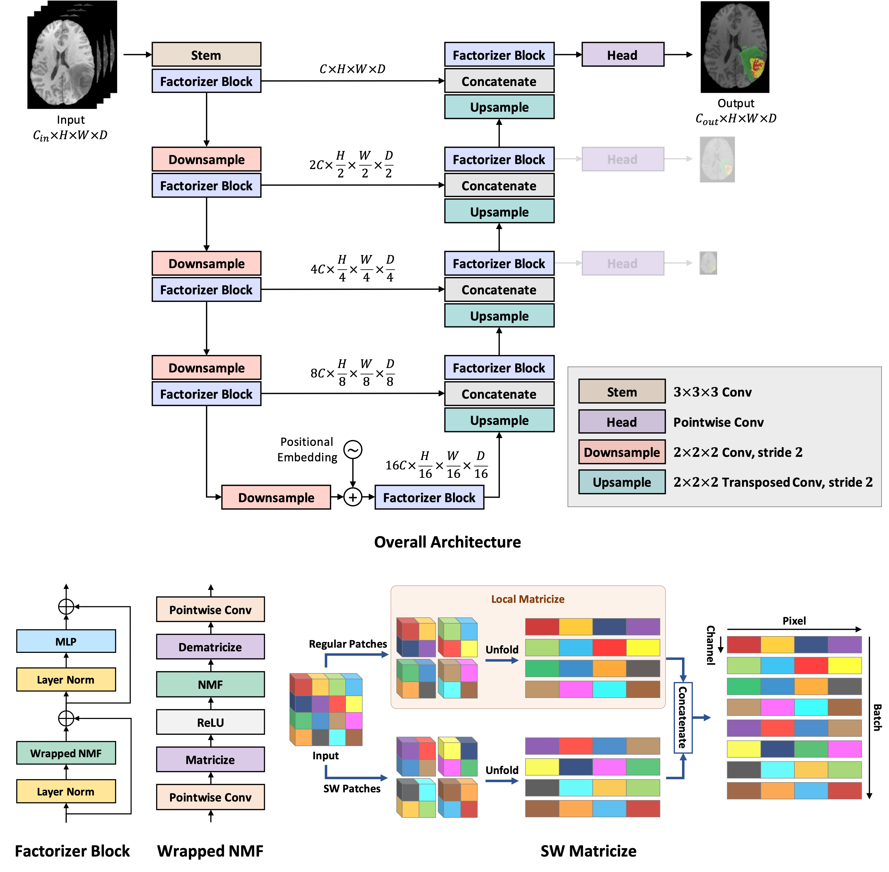

This repository is the official implementation of ["Factorizer: A Scalable Interpretable Approach to Context Modeling for Medical Image Segmentation"](https://doi.org/10.1016/j.media.2022.102706).

## Introduction

**Factorizer** leverages the power of low-rank matrix approximation to construct end-to-end deep models for medical image segmentation. Built upon differentiable matrix factorization layers and matricize operations, Factorizer models with U-shaped architectures can compete favorably with CNN and Transformer baselines in terms of accuracy, scalability, and interpretability. Details on the methods and results for brain tumor segmentation and stroke lesion segmentation can be found in our [paper](https://doi.org/10.1016/j.media.2022.102706).



## Installation

First, ensure that you have [PyTorch](https://pytorch.org/get-started/locally/) installed. The installation details depend on your system configuration (CPU, GPU, etc.); refer to the PyTorch installation guide for more information.

To install the Factorizer package, run:

```bash
pip install git+https://github.com/pashtari/factorizer.git
```


## Usage

Import required modules:

```python
import torch
from torch import nn
import factorizer as ft
```

**Nonnegative Matrix Factorization Layer**
```python
nmf = ft.NMF(size=(8, 512), rank=2, num_iters=5, init="uniform", solver="mu")

x = torch.rand((1, 8, 512), requires_grad=True)

y = nmf(x)  # Output shape: (1, 8, 512)
```

**Shifted Window Matricize**
```python
sw_matricize = ft.SWMatricize((None, 32, 128, 128, 128), head_dim=8, patch_size=8)

x = torch.rand((1, 32, 128, 128, 128), requires_grad=True)

y = sw_matricize(x)  # Output shape: (8, 4096, 8, 512)

z = sw_matricize.inverse_forward(y)

torch.equal(x, z)  # Returns: True
```

**Swin Factorizer Block**
```python
factorizer_block = ft.FactorizerBlock(
    channels=32,
    spatial_size=(128, 128, 128),
    norm=ft.LayerNorm,
    reshape=(ft.SWMatricize, {'head_dim': 8, 'patch_size': 8}),
    act=nn.ReLU,
    factorize=ft.NMF,
    rank=1,
    num_iters=5,
    init="uniform",
    solver="hals",
    mlp_ratio=2,
    dropout=0.1
)

x = torch.rand((1, 32, 128, 128, 128), requires_grad=True)

y = factorizer_block(x)  # Output shape: (1, 32, 128, 128, 128)
```

**Swin Factorizer**
```python
swin_factorizer = ft.Factorizer(
    in_channels=4,
    out_channels=3,
    spatial_size=(128, 128, 128),
    encoder_depth=(1, 1, 1, 1, 1),
    encoder_width=(32, 64, 128, 256, 512),
    strides=(1, 2, 2, 2, 2),
    decoder_depth=(1, 1, 1, 1),
    norm=ft.LayerNorm,
    reshape=(ft.SWMatricize, {'head_dim': 8, 'patch_size': 8}),
    act=nn.ReLU,
    factorize=ft.NMF,
    rank=1,
    num_iters=5,
    init="uniform",
    solver="hals",
    mlp_ratio=2,
    dropout=0.1
)

x = torch.rand((1, 4, 128, 128, 128))

y = swin_factorizer(x)  # Output shape: (1, 3, 128, 128, 128)
```


## License

This repository is released under the Apache 2.0 license as found in the [LICENSE](LICENSE) file.


## Citation

If you use this code for a paper, please cite:

```
@article{ashtari2023factorizer,
  title     = {Factorizer: A scalable interpretable approach to context modeling for medical image segmentation},
  author    = {Ashtari, Pooya and Sima, Diana M and De Lathauwer, Lieven and Sappey-Marinier, Dominique and Maes, Frederik and Van Huffel, Sabine},
  journal   = {Medical image analysis},
  publisher = {Elsevier},
  year      = {2023},
  issn      = {1361-8415},
  doi       = {https://doi.org/10.1016/j.media.2022.102706},
  pages     = {102706},
  volume    = {84},

}
```


## Contact

This repo is currently maintained by Pooya Ashtari ([@pashtari](https://github.com/pashtari)).